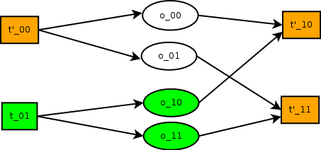

Disco Concurrent Stages
===========

concurrency in case of split grouping
-----

In the concurrent stages model, disco will run a couple of consecutive stages
concurrently.  Which means, a future stage (e.g. reduce) will run concurrently
with the previous stage (e.g. map).

The simplest type of concurrency is when the grouping of a stage is "split".
This means, each task of a future stage will consume the outputs of
exactly one task of the previous stage.

In this case, as soon as that single input is consumed, the task is done and might
be terminated.  This is the only type of grouping that might be executed concurrently
at the moment.

Concurrency in this type of grouping
is not very useful per se.  Because these two stages could have been combined in
the first place.  However, it is the same type of concurrency that Apache Spark
offers).

concurrency in case of other types of grouping
-----

For the other types of concurrencies, Disco will let you run a job in the cluster
and specify the _concurrent_ flag for a stage.  If
this flag is specified for a stage, the tasks of that stage are going to be a
candidate to get started as soon as their inputs are available.  In other words,
some stages will be made concurrent.  If there are enough resources, the tasks
of these two stages can actually run in parallel and will result in a smaller
turnaround time for the job.

Assume we have a pipeline like this figure:

Also assume that we set the concurrent flag for stage 1

With this pipeline, the tasks t_10 and t_11 in stage 1 will be started as
soon as any of their inputs is ready to be consumed.

However, not all of the inputs are ready at this point which means the tasks
t_10 and t_11 will have to wait for the future inputs once it is done
processing its available inputs.  And the task in stage 1
cannot be terminated until all of its potential producers in stage 0 have been
terminated.

Usage
-----

The concurrent flag should not be used in combination with the
combine or sort flags which require all of the outputs of the previous stage to
be available before starting a task.  Therefore, the concurrent flag will not
speedup the map-reduce computations.

Moreover, all of the workers will be notified that there might be more inputs in
the future and should keep asking for the new inputs until Disco tells them they
can stop.  This is part of the current worker protocol but is not implemented
yet.

The job_coordinator is responsible for spawning tasks.  In the sequential stages model,
Disco waits until all of the inputs of a task are available before running it.

In the new model, the job_coordinator does not have this luxury so it has to
establish a communication channel to the task.  The task will run and consume
its available inputs but the future inputs are received via the channel.

Failure Recovery
----------

In the concurrent stage model, the failure recovery is kept simple to minimize the
complexity of the implementation.
If a task fails, all of the tasks that could have consumed the outputs of this task
will fail.

For example, consider the following pipeline:
In these figures:
Tasks are shown with boxes. White box means the task has not started yet, orange box
means the task is running, green box means task finished successfully and red box means
the task has failed.

Data is shown with ovals. The green oval means an input that is available for
consumption and white oval means a data that is not available yet.

Tasks t_00 and t_01 belong to the first stage which will run concurrently with
the second stage.  That means, as soon as the outputs of these tasks are
available, they will be consumed by the tasks of the next stage.

.. image:: images/failure_S0.png
    :height: 400px
    :width: 800px
    :align: center
    :scale: 75 %
    :alt: a task in the first stage fails

Now assume task t_00 fails.  The failure is propagated and all of the tasks that
could have consume the inputs of this task will fail.
This means tasks t_10 and t_11 in this figure will fail and restart.

As you see it is a wasteful operation in this case because task t_10 has already
finished successfully. However, in order to simplify the failure recovery, all
of such tasks will be restarted on such a failure.  These failures might
propagate to the future stages if there is any tasks running.

Please note that whether we persist the outputs of a task or not is orthogonal
to the concurrent stages.  We might be able to speed up the pipeline by avoiding
persistence of data on disk, however, if there is a failure, we have to
backtrack and start over the tasks that produced such outputs.

It is also assumed that the order of the inputs is not important.  The inputs will be
consumed as soon as they are available.  Usually if the user does not specify an
order, he or she will not care about the order at all.
